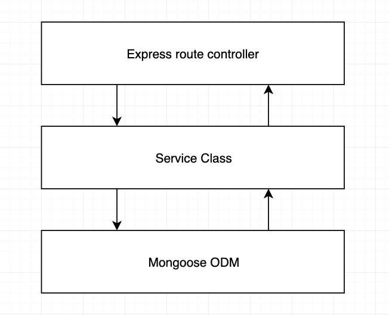

# Hotel-Location-Management-System

A simple online hotel location management system built with MongodDB, Express.js and Node.js.

## Table of Contents

- [Hotel-Location-Management-System](#hotel-location-management-system)
  - [Table of Contents](#table-of-contents)
  - [Techonologies used in this application](#techonologies-used-in-this-application)
    - [Front-end](#front-end)
    - [Back-end](#back-end)
  - [Install dependencies](#install-dependencies)
    - [Install dev dependencies if needed](#install-dev-dependencies-if-needed)
  - [Run the application](#run-the-application)
  - [Functionalitites](#functionalitites)
    - [Management functionalities](#management-functionalities)
    - [Assistant functionalities](#assistant-functionalities)
    - [Tourist functionalities](#tourist-functionalities)

## Techonologies used in this application

### Front-end

1. React
2. Chakra UI

### Back-end

1. MongoDB
2. Express.js
3. Node.js
4. Passport.js

## Folder Structure

```html
│   app.js          # App entry point
|   package.json    # Dependencies for the app
|   .env            # Environment variables and configuration related stuff
└───bin             # www file is here
└───controllers     # Controllers for the app
└───middleware      # Middleware of the app
└───models          # Database models
└───public          # Public files of the app
└───routes          # Express routes for all the endpoints of the app
└───services        # All the business logic is here
└───views           # Views for the app
```

## 3 Layer architecture



## Install dependencies

Open git bash or command line tools at application file and run following npm command or if you know what to do, just look at `package.json` file.

`npm install --save`

### Install dev dependencies if needed

`npm install nodemon --save-dev`

## Run the application

- create a `.env` file in app directory
- run `npm run dev`
- App will open at [http://localhost:5000](http://localhost:5000)

## Functionalitites

For presenting purposes users of the app is divided into three categories.

- Management
- Assistant
- Tourist

### Management functionalities

- [ ]  Sign up (This route is hidden. only accessible by typing the route manually and when admin log in)
- [ ]  Login
- [ ]  Logout
- [ ]  Dashboard
- [ ]  Track all users(assistants, tourists) activities
- [ ]  Add Assistants
- [ ]  Update Assistants
- [ ]  Delete Assistants
- [ ]  Search Assistants by name, designation
- [ ]  Browse Visiting places
- [ ]  Add Visiting places
- [ ]  Update Visiting places
- [ ]  Delete Visiting places
- [ ]  Search Visiting places by name
- [ ]  Restrict individual user if violate any terms and conditions
- [ ]  Send notification to all/individual/filtered user (not a main requirement)
- [ ]  Update profile and password

### Assistant functionalities

- [ ]  Login
- [ ]  Logout
- [ ]  Dashboard
- [ ]  Track all tourists activities
- [ ]  Add tourists
- [ ]  Update tourists
- [ ]  Delete tourists
- [ ]  Search tourists by name
- [ ]  Browse schedules
- [ ]  Search Visiting places by date, desitination, travelling method
- [ ]  View Complain and Act
- [ ]  Send notification to all/individual/filtered user (not a main requirement)
- [ ]  Update profile and password

### Tourist functionalities

- [ ]  Login
- [ ]  Logout
- [ ]  Dashboard
- [ ]  View Visiting places
- [ ]  Search Visiting places by name
- [ ]  Track own schedules
- [ ]  Add new schedule
- [ ]  Update schedule
- [ ]  View travelling methods
- [ ]  Search travelling methods by name
- [ ]  Cancel/Mark as completed schedule
- [ ]  Ask for Help / Complain
- [ ]  Upload/Update profile picture
- [ ]  Update profile and password
